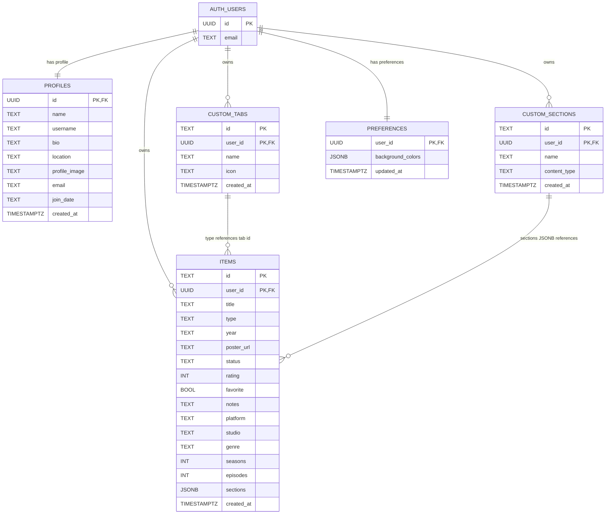

# My Collection — Entity Relationship Diagram

## ER Diagram

```
┌─────────────────────────┐
│      auth.users         │  (Supabase built-in)
│─────────────────────────│
│  id          UUID  [PK] │
│  email       TEXT       │
│  ...                    │
└──────────┬──────────────┘
           │
           │ 1
           │
     ┌─────┴──────────────────────────────────────────────────┐
     │                    │                │                   │
     │ 1                  │ 1              │ 1                 │ 1
     ▼                    ▼                ▼                   ▼
┌────────────────┐  ┌──────────────┐ ┌───────────────┐  ┌─────────────────┐
│   profiles     │  │    items      │ │  custom_tabs  │  │ custom_sections │
│────────────────│  │──────────────│ │───────────────│  │─────────────────│
│ id       [PK] │  │ id      [PK] │ │ id      [PK]  │  │ id        [PK]  │
│ = auth.users.id│  │ user_id [PK] │ │ user_id [PK]  │  │ user_id   [PK]  │
│────────────────│  │──────────────│ │───────────────│  │─────────────────│
│ name     TEXT  │  │ title   TEXT  │ │ name    TEXT  │  │ name      TEXT  │
│ username TEXT  │  │ type    TEXT  │ │ icon    TEXT  │  │ content_  TEXT  │
│ bio      TEXT  │  │ year    TEXT  │ │ created_at    │  │   type          │
│ location TEXT  │  │ poster_ TEXT  │ │   TIMESTAMPTZ │  │ created_at      │
│ profile_ TEXT  │  │   url         │ └───────────────┘  │   TIMESTAMPTZ   │
│   image        │  │ status  TEXT  │                    └─────────────────┘
│ email    TEXT  │  │ rating  INT  │
│ join_date TEXT │  │ favorite BOOL│        ┌──────────────────┐
│ created_at     │  │ notes   TEXT │        │   preferences    │
│   TIMESTAMPTZ  │  │ platform TEXT│        │──────────────────│
└────────────────┘  │ studio  TEXT │        │ user_id [PK]     │
                    │ genre   TEXT │        │ = auth.users.id  │
                    │ seasons INT  │        │──────────────────│
                    │ episodes INT │        │ background_      │
                    │ sections     │        │   colors  JSONB  │
                    │        JSONB │        │ updated_at       │
                    │ created_at   │        │   TIMESTAMPTZ    │
                    │   TIMESTAMPTZ│        └──────────────────┘
                    └──────────────┘
```

## Mermaid Diagram



## Relationships

| Relationship | Cardinality | Description |
|---|---|---|
| `auth.users` → `profiles` | 1 : 1 | Auto-created via trigger on signup |
| `auth.users` → `items` | 1 : Many | A user owns many collection items (movies, tv shows, restaurants, places, custom) |
| `auth.users` → `custom_tabs` | 1 : Many | A user owns many custom tabs |
| `auth.users` → `custom_sections` | 1 : Many | A user owns many custom sections |
| `auth.users` → `preferences` | 1 : 1 | One preferences row per user |
| `custom_tabs.id` ← `items.type` | Logical (1 : Many) | Items reference their tab via the `type` field (not a foreign key) |
| `custom_sections.id` ← `items.sections` | Logical (Many : Many) | Items reference sections via JSONB array (not a foreign key) |

## Key Design Decisions

- **Composite primary keys** on `items`, `custom_tabs`, `custom_sections` — `(id, user_id)` — allows the same item ID across different users
- **Row Level Security (RLS)** on all tables — users can only read/write rows where `auth.uid() = user_id`
- **JSONB for `items.sections`** — avoids a many-to-many join table, matches existing TypeScript `string[]` model
- **TEXT IDs** — preserves existing `Date.now().toString()` ID format from the client, no migration needed
- **`profiles` auto-creation** — a Postgres trigger on `auth.users` INSERT automatically creates a `profiles` row on signup
- **`items` table is polymorphic** — the `type` column determines whether a row is a movie, tv-show, restaurant, place, or custom collection item

## SQL Schema

```sql
-- PROFILES (extends auth.users with app-specific fields)
CREATE TABLE public.profiles (
  id UUID PRIMARY KEY REFERENCES auth.users(id) ON DELETE CASCADE,
  name TEXT NOT NULL DEFAULT '',
  username TEXT NOT NULL DEFAULT '',
  bio TEXT NOT NULL DEFAULT '',
  location TEXT NOT NULL DEFAULT '',
  profile_image TEXT,
  email TEXT NOT NULL DEFAULT '',
  join_date TEXT NOT NULL DEFAULT '',
  created_at TIMESTAMPTZ NOT NULL DEFAULT now()
);

ALTER TABLE public.profiles ENABLE ROW LEVEL SECURITY;

CREATE POLICY "Users can read own profile"
  ON public.profiles FOR SELECT USING (auth.uid() = id);
CREATE POLICY "Users can update own profile"
  ON public.profiles FOR UPDATE USING (auth.uid() = id);
CREATE POLICY "Users can insert own profile"
  ON public.profiles FOR INSERT WITH CHECK (auth.uid() = id);

-- Auto-create profile on signup
CREATE OR REPLACE FUNCTION public.handle_new_user()
RETURNS TRIGGER AS $$
BEGIN
  INSERT INTO public.profiles (id, email, join_date)
  VALUES (NEW.id, NEW.email, to_char(now(), 'FMMonth YYYY'));
  RETURN NEW;
END;
$$ LANGUAGE plpgsql SECURITY DEFINER;

CREATE TRIGGER on_auth_user_created
  AFTER INSERT ON auth.users
  FOR EACH ROW EXECUTE FUNCTION public.handle_new_user();

-- ITEMS (polymorphic: movies, tv-shows, restaurants, places, custom tab items)
CREATE TABLE public.items (
  id TEXT NOT NULL,
  user_id UUID NOT NULL REFERENCES auth.users(id) ON DELETE CASCADE,
  title TEXT NOT NULL,
  type TEXT NOT NULL,
  year TEXT,
  poster_url TEXT,
  status TEXT NOT NULL DEFAULT 'want-to-see',
  rating INTEGER,
  favorite BOOLEAN NOT NULL DEFAULT false,
  notes TEXT,
  platform TEXT,
  studio TEXT,
  genre TEXT,
  seasons INTEGER,
  episodes INTEGER,
  sections JSONB DEFAULT '[]'::jsonb,
  created_at TIMESTAMPTZ NOT NULL DEFAULT now(),
  PRIMARY KEY (id, user_id)
);

ALTER TABLE public.items ENABLE ROW LEVEL SECURITY;

CREATE POLICY "Users CRUD own items"
  ON public.items FOR ALL USING (auth.uid() = user_id) WITH CHECK (auth.uid() = user_id);

CREATE INDEX idx_items_user_type ON public.items (user_id, type);

-- CUSTOM_TABS
CREATE TABLE public.custom_tabs (
  id TEXT NOT NULL,
  user_id UUID NOT NULL REFERENCES auth.users(id) ON DELETE CASCADE,
  name TEXT NOT NULL,
  icon TEXT NOT NULL,
  created_at TIMESTAMPTZ NOT NULL DEFAULT now(),
  PRIMARY KEY (id, user_id)
);

ALTER TABLE public.custom_tabs ENABLE ROW LEVEL SECURITY;

CREATE POLICY "Users CRUD own tabs"
  ON public.custom_tabs FOR ALL USING (auth.uid() = user_id) WITH CHECK (auth.uid() = user_id);

-- CUSTOM_SECTIONS
CREATE TABLE public.custom_sections (
  id TEXT NOT NULL,
  user_id UUID NOT NULL REFERENCES auth.users(id) ON DELETE CASCADE,
  name TEXT NOT NULL,
  content_type TEXT NOT NULL,
  created_at TIMESTAMPTZ NOT NULL DEFAULT now(),
  PRIMARY KEY (id, user_id)
);

ALTER TABLE public.custom_sections ENABLE ROW LEVEL SECURITY;

CREATE POLICY "Users CRUD own sections"
  ON public.custom_sections FOR ALL USING (auth.uid() = user_id) WITH CHECK (auth.uid() = user_id);

-- PREFERENCES
CREATE TABLE public.preferences (
  user_id UUID PRIMARY KEY REFERENCES auth.users(id) ON DELETE CASCADE,
  background_colors JSONB NOT NULL DEFAULT '{}'::jsonb,
  updated_at TIMESTAMPTZ NOT NULL DEFAULT now()
);

ALTER TABLE public.preferences ENABLE ROW LEVEL SECURITY;

CREATE POLICY "Users CRUD own prefs"
  ON public.preferences FOR ALL USING (auth.uid() = user_id) WITH CHECK (auth.uid() = user_id);
```
